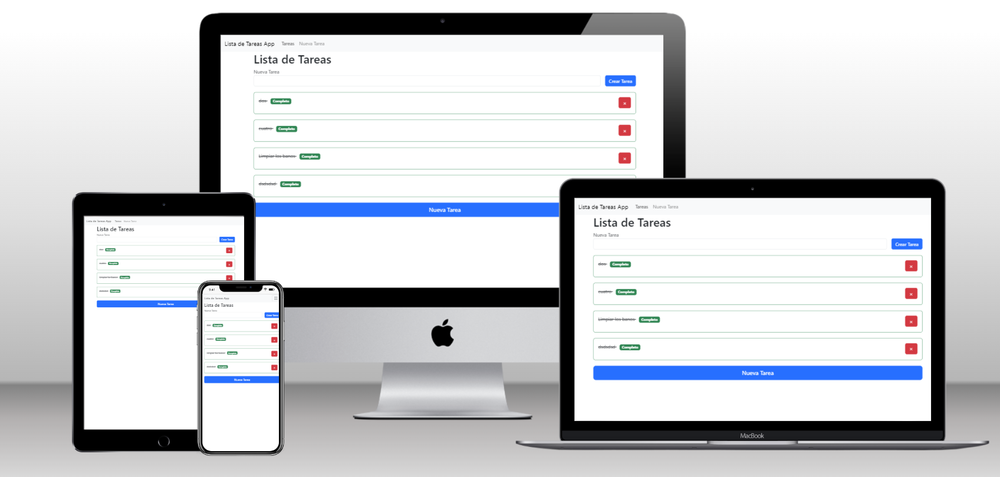

<a name="readme-top"></a>

<div align="center">
  
  <br/>

  <h3><b>Lista de Tareas App</b></h3>

</div>

<!-- TABLE OF CONTENTS -->

# 📗 Table of Contents

- [📗 Table of Contents](#-table-of-contents)
- [📖 Lista de Tareas App ](#-lista-de-tareas-app-)
  - [🛠 Built With ](#-built-with-)
    - [Tech Stack ](#tech-stack-)
    - [Key Features ](#key-features-)
  - [🚀 Live Demo ](#-live-demo-)
  - [💻 Getting Started ](#-getting-started-)
    - [Prerequisites](#prerequisites)
    - [Setup](#setup)
    - [Install](#install)
    - [Usage](#usage)
    - [Run tests](#run-tests)
    - [Deployment](#deployment)
  - [👥 Authors ](#-authors-)
  - [🔭 Future Features ](#-future-features-)
  - [🤝 Contributing ](#-contributing-)
  - [⭐️ Show your support ](#️-show-your-support-)
  - [🙏 Acknowledgments ](#-acknowledgments-)
  - [📝 License ](#-license-)

<!-- PROJECT DESCRIPTION -->

# 📖 Lista de Tareas App <a name="about-project"></a>

**Lista de Tareas App** is a task management application developed using Laravel and MySQL as backend technologies. Bootstrap has been utilized to define the application's styles, providing a user-friendly interface for managing tasks and activities.

## 🛠 Built With <a name="built-with"></a>

### Tech Stack <a name="tech-stack"></a>


<details>
  <summary>Laravel</summary>
  <ul>
    <li><a href="https://laravel.com/docs/10.x/readme">Laravel</a></li>
  </ul>
</details>

<details>
  <summary>MySQL</summary>
  <ul>
    <li><a href="https://www.mysql.com/">MySQL</a></li>
  </ul>
</details>

<details>
<summary>Bootstrap</summary>
  <ul>
    <li><a href="https://getbootstrap.com/">Bootstrap</a></li>
  </ul>
</details>

<!-- Features -->

### Key Features <a name="key-features"></a>

- **DataBase**
- **Backend**
- **SPA**

<p align="right">(<a href="#readme-top">back to top</a>)</p>

<!-- LIVE DEMO -->

## 🚀 Live Demo <a name="live-demo"></a>

> Not available yet.


<p align="right">(<a href="#readme-top">back to top</a>)</p>

<!-- GETTING STARTED -->

## 💻 Getting Started <a name="getting-started"></a>

To get a local copy up and running, follow these steps.

### Prerequisites

In order to run this project you need:

<!--
Example command:

```sh
 gem install rails
```
 -->

### Setup

Clone this repository to your desired folder:

```sh
    cd my-folder
    git@github.com:oovillagran/ct-candidates-app.git
```

### Install

Install this project with:


```sh
  cd ct-candidates-app
  Open the terminal into the root directory
  composer install
  npm install
  copy .env.example and rename it to .env
  php artisan key:generate
  Set up the database
  Run php artisan migrate
```

### Usage

To run the project, execute the following command:


```sh
  php artisan serve
```
-

### Run tests

N/A

### Deployment

N/A


<p align="right">(<a href="#readme-top">back to top</a>)</p>

<!-- AUTHORS -->

## 👥 Authors <a name="authors"></a>


👤 **Author1**

- GitHub: [@oovillagran](https://github.com/oovillagran)
- Twitter: [@oovillagran](https://twitter.com/oovillagran)
- LinkedIn: [oovillagran](https://linkedin.com/in/oovillagran)


<p align="right">(<a href="#readme-top">back to top</a>)</p>

<!-- FUTURE FEATURES -->

## 🔭 Future Features <a name="future-features"></a>

- [ ] **Set up user login option**
- [ ] **Set up authorization**
- [ ] **Show activities for login users**

<p align="right">(<a href="#readme-top">back to top</a>)</p>

<!-- CONTRIBUTING -->

## 🤝 Contributing <a name="contributing"></a>

Thanks to [Paul Sabando](https://github.com/pspaulus) from [Funiber](www.funiber.org) for allowing me to work on this grateful assignment.

Feel free to check the [issues page](../../issues/).

<p align="right">(<a href="#readme-top">back to top</a>)</p>

<!-- SUPPORT -->

## ⭐️ Show your support <a name="support"></a>

> Write a message to encourage readers to support your project

If you like this project feel free to reach me on my accounts or email me at oscar.villagran@hotmail.com.

<p align="right">(<a href="#readme-top">back to top</a>)</p>

<!-- ACKNOWLEDGEMENTS -->

## 🙏 Acknowledgments <a name="acknowledgements"></a>

> Give credit to everyone who inspired your codebase.

I would like to thank...

<p align="right">(<a href="#readme-top">back to top</a>)</p>


<!-- LICENSE -->

## 📝 License <a name="license"></a>

N/A

<p align="right">(<a href="#readme-top">back to top</a>)</p>